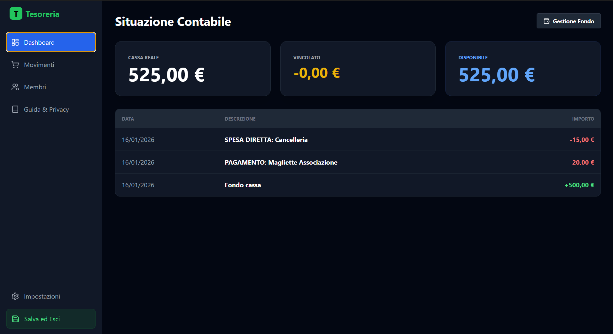

# 💰 App Tesoreria

**Il gestionale open-source definitivo per associazioni, collettivi e realtà no-profit.**

App Tesoreria sostituisce i complessi fogli Excel con un'interfaccia moderna e intuitiva, progettata per gestire conti comuni, debiti dei soci e riconciliazione bancaria senza richiedere conoscenze contabili avanzate.



## ✨ Funzionalità Principali

### 📊 Dashboard Finanziaria Intelligente
*   **Cassa Reale vs Disponibile**: Distingue chiaramente tra i soldi che *hai* fisicamente e quelli che puoi *spendere* (al netto dei fondi vincolati per eventi in corso).
*   **Analisi Vincolato**: Visualizza nel dettaglio quali progetti stanno bloccando liquidità e quanto è stato raccolto vs speso.

### 👥 Gestione Soci e Quote
*   **Anagrafica Centralizzata**: Import/Export massivo da Excel.
*   **Tracciamento Debiti**: Sai sempre chi deve pagare cosa. Genera liste morosi con un click.
*   **Acquisti Condivisi**: Crea una spesa (es. "Merchandising"), assegnala ai soci e il sistema calcolerà automaticamente le quote individuali.

### 🛡️ Affidabilità e Sicurezza
*   **Privacy First**: Database locale (SQLite). I tuoi dati finanziari non lasciano mai il tuo PC.
*   **Backup Automatici**: Sistema di backup rotativo integrato.
*   **Reset Fabbrica**: Funzione di emergenza per ripristinare il database allo stato iniziale in caso di corruzione critica o test.
*   **Modifiche Retroattive**: Correggi errori su eventi passati e il sistema ricalcolerà l'intero storico contabile in tempo reale.

---

## 🛠 Stack Tecnologico

Il progetto è costruito su fondamenta moderne per garantire performance e manutenibilità:

*   **Core**: [Electron](https://www.electronjs.org/) (Desktop Runtime)
*   **Frontend**: React 18 + TypeScript + TailwindCSS
*   **Backend Locale**: Node.js + `better-sqlite3`
*   **Engine**: Vite (Build & HMR ultra-rapido)

Vedi [docs/TDD.md](./docs/TDD.md) per i dettagli architetturali completi.

---

## 🚀 Installazione e Sviluppo

### Prerequisiti
*   Node.js (v18 o superiore)
*   npm

### Setup Rapido

1.  **Clona il repository**
    ```bash
    git clone https://github.com/tuo-user/App-Tesoreria.git
    cd App-Tesoreria/app
    ```

2.  **Installa le dipendenze**
    ```bash
    npm install
    ```

3.  **Avvia in modalità Sviluppo**
    ```bash
    npm run dev
    ```

4.  **Compila per Produzione**
    ```bash
    npm run build
    ```
    L'eseguibile verrà generato nella cartella `dist`.

---

## 🤝 Contribuire

Le Pull Request sono benvenute!
1.  Forka il progetto.
2.  Crea un branch per la tua feature (`git checkout -b feature/NuovaFeature`).
3.  Committa le modifiche.
4.  Apri una Pull Request.

## 📄 Licenza

Distribuito sotto licenza **MIT**. Sentiti libero di usarlo, modificarlo e distribuirlo.
